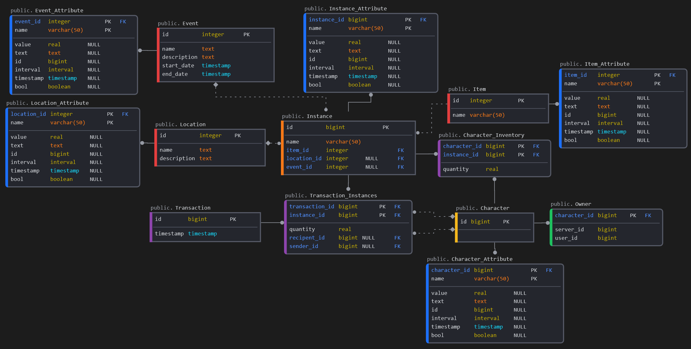

# ItemsAPI

SQL Schema for storing & managing items, transactions & ownership.


# Features

- Double-Entry Accounting (-ish) based transactions/inventory count
- "Safe" add/remove functions (Modify only if character has enough in inventory to send)
- Leaderboards for owned items
- Extendable during run-time with Attributes
- Statistics of spawned/claimed items per drop

# Schema



# Exposed Views

These are exposed views in `public` schema over tables from within `items` schema:

## Transactions

### View
- GET `/transactions` - List of all transactions.
- POST `/transactions` - Inserts new transaction. Basically acts as adding/remove item to/from a user. 
- DELETE `/transactions` - Inserts new transaction as "outgoing" (that is, one that will be deduced from character's inventory). NOTE: Not providing timestamp WILL cause insertion of multiple transactions for each existing matching query

### Functions
- POST `/rpc/transaction` - Make new transaction between one or two users
- POST `/rpc/item_add` - Add specific item to user(s) within single transaction
- POST `/rpc/item_remove` - Remove specific item from user(s) if they have enough items to remove
Note: Merge both of the above into `modify`?

## Inventories

### View
- GET `/inventories` - List of owned items by character.
- POST `/inventories` - Adds new transaction that adds more of specified item 
- DELETE `/inventories` - Adds new transaction that removes specified item 

### Functions
- POST `/rpc/inventory` - Retrieve character's balance of specified item

## Statistics, Leaderboards

### View
- GET `/statistics` - List of spawned/claimed items.

### Functions
- POST `/rpc/leaderboard` - Scoreboard with Characters owning most of specified item within provided timeframe
- POST `/rpc/leaderboards` - List of available scoreboards in group within provided timeframe

## Drops
### View
- GET `/drops` - List of items with their drop chance.
- POST `/drops` - Creates new item drop chance
- PATCH `/drops` - Modifies existing drop chance
- DELETE `/drops` - Removes item drop chance

### Functions
- POST `/rpc/drops` - List of all drop attributes
- POST `/rpc/attribute_drop` - Add/Change attribute of a `Drop`

## Items
### View
- GET `/items` - List of base items with their base attributes.
- POST `/items` - Creates new item
- PATCH `/items` - Modifies existing item
- DELETE `/items` - Removes exisitng item

### Functions
- POST `/rpc/item` - List of all item attributes
- POST `/rpc/attribute_item` - Add/Change attribute of an `Item`

## Events
### View
- GET `/events` - List of events with their base attributes.
- POST `/events` - Creates new event
- PATCH `/events` - Modifies existing event
- DELETE `/events` - Removes existing event

### Functions
- POST `/rpc/event` - List of all event attributes
- POST `/rpc/attribute_event` - Add/Change attribute of an `Event`

## Locations
### View
- GET `/locations` - List of locations with their base attributes.
- POST `/locations` - Creates new location
- PATCH `/locations` - Modifies existing location
- DELETE `/locations` - Removes existing location

### Functions
- POST `/rpc/locations` - List of all location attributes
- POST `/rpc/attribute_location` - Add/Change attribute of a `Location`

## Characters
### View
- GET `/characters` - List of characters with their base attributes.
- POST `/characters` - Creates new character
- PATCH `/characters` - Modifies existing character
- DELETE `/characters` - Removes existing character

### Functions
- POST `/rpc/character` - List all character attributes
- POST `/rpc/attribute_character` - Add/Change attribute of a `Character`

- POST `/rpc/character_create` - Create new character #NOTE Unnecessary? Dupliactes behaviour of POST `/characters`

## Instances
### View
- GET `/instances` - List of instanciated items with their base attributes.
- POST `/instances` - Creates new instance
- PATCH `/instances` - Modifies existing instance
- DELETE `/instances` - Removes existing instance

### Functions
- POST `/rpc/instance` - List of all instances attributes
- POST `/rpc/attribute_instance` - Add/Change attribute of an `Instance`

# Operations on Views

# Exposed Functions

## Data fetching

These are basically stored queries within database. Done mostly due to lack of aggregate options within PostgREST (at least as of January 2023)

## Data insertion


## Attributes

Access to these attributes is TBD

# Running

```sh
docker-compose up
```
